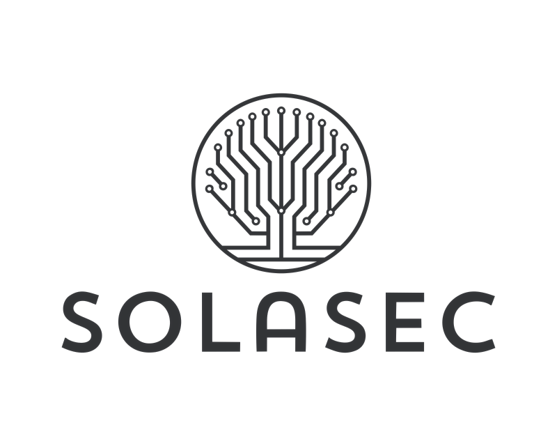
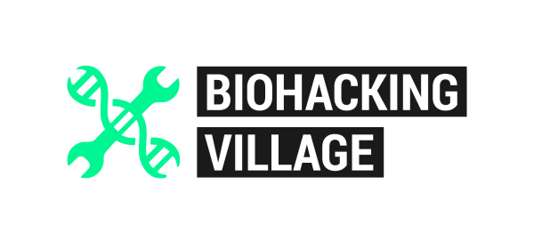

# Biohacking Village DEF CON Badge Firmware

The Biohacking Village (BHV) badge is a wearable, off-grid messenger with a pulse sensor and a heartbeat made of light. It lets badge holders chat across a private LoRa mesh, exchange direct “heart to heart” messages, and personalize how their badge reacts to people and conversations around them.

This repository is a customized fork of the [Meshtastic firmware project](https://github.com/meshtastic/firmware). Meshtastic provides the open-source, long-range mesh networking underneath the badge; this fork adds the BHV hardware support, event configuration, heartbeat sensing, LED animations, and text-message customization commands.

<p align="center">
  
</p>

<p align="center"><strong>Sponsors</strong></p>

<p align="center">
  <a href="https://solasec.com/"></a>
  &nbsp;&nbsp;&nbsp;&nbsp;
  <a href="https://www.pcbway.com/"></a>
  &nbsp;&nbsp;&nbsp;&nbsp;
  <a href="https://www.villageb.io/"></a>
</p>

> **No cell service, Wi-Fi, or custom BHV app is required.** The badge communicates over LoRa and works with the standard Meshtastic apps.

## Get connected

1. Install a Meshtastic client:
   - [Meshtastic for Apple devices](https://msh.to/ios) — iPhone, iPad, and macOS
   - [Meshtastic for Android](https://msh.to/android)
   - [Meshtastic Web](https://client.meshtastic.org/) — compatible browsers and USB/Bluetooth connections
2. Turn on the badge and enable Bluetooth on your phone.
3. In the app, add or select the badge from the list of nearby Meshtastic devices.
4. If the app asks for a pairing code, enter the code shown on the badge display.
5. Open **Messages**, select a channel or person, and say hello.

The event channels are already installed on provisioned badges. You should not need to copy channel keys or change radio settings to join the BHV mesh.

## Interacting with the badge

You can explore the badge directly with the small navigation button beside the display:

- **Press — Next:** move to the next screen or item.
- **Hold — Select:** hold for about half a second to open the current screen's menu or choose the highlighted item.
- **Reset:** press the recessed reset button beside the USB-C connector to restart the badge if it becomes unresponsive. Resetting does not erase your saved settings.

<p align="center">
  
</p>

The action performed by **Select** depends on the screen. For example, it can open a page menu, show message-response options, or confirm a highlighted choice. A quick press always advances through the normal badge screens.

### Turning the badge off

Every page includes a shutdown option:

1. **Hold** the navigation button to open the page menu.
2. **Press** the button until **Shutdown** is highlighted.
3. **Hold** the button again to select **Shutdown**.

## How the badge works

The badge combines three experiences:

- **A Meshtastic radio.** Messages travel from badge to badge over LoRa. Nearby badges can relay packets, extending the event mesh without relying on internet or cellular infrastructure.
- **A pulse-sensing heart.** A MAX3010x optical sensor measures heart rate and blood-oxygen data when a finger is present. While a reading is active, the 14 heartbeat LEDs follow the measured pulse; otherwise they animate at the configured idle rate.
- **A social light layer.** Sending or receiving channel messages and direct messages creates colored pulses. Colors and pulse counts can be customized globally, for a channel, or for an individual direct-message conversation.

The badge ships with two event channels:

| Channel | Purpose | Who can send? |
| --- | --- | --- |
| `BHV` | Attendee conversation and badge-to-badge chat | Everyone |
| `BHV Info` | Official Village information and announcements | BHV staff |

`BHV Info` is read-only on attendee firmware. Attendee badges can receive and relay its announcements, but attempts to post there are rejected with `BHV Info is read-only on attendee badges`.

## What it looks like in practice

### Meet people across the Village

Alex sends “Where is the hardware hacking table?” to the `BHV` channel. Other badges carry the message across the Village, and receiving badges pulse in the channel’s colors. Someone replies with directions without either phone needing internet access.

### Send a heart to heart

Morgan opens another badge holder in the Meshtastic node list and sends a direct message. The recipient’s badge plays its direct-message light pattern. Either person can give that conversation its own colors, so future messages from that person are recognizable at a glance.

```text
<3 set dm color pink purple
```

Send that command inside the direct-message conversation to personalize that peer.

### Put your pulse on display

Place a finger steadily over the optical sensor. Once the badge has a usable signal, its LEDs follow the live heart-rate reading and the badge can report heart-rate and SpO2 telemetry through Meshtastic. Remove your finger and the badge returns to its idle heartbeat.

### Follow Village announcements

BHV staff post a schedule change to `BHV Info`. Attendee badges receive and relay the announcement and show the configured notification pulse, while the read-only policy prevents ordinary attendee posts from flooding the announcements channel.

## Make the badge yours

Customization commands are ordinary Meshtastic messages, so no separate app or setup screen is needed. Start a message with any of these triggers:

```text
#!
🫀
<3
```

For example, all three messages below invoke the same command:

```text
#! set default color red blue
🫀 set default color red blue
<3 set default color red blue
```

Commands sent from the connected phone are handled locally and are not transmitted over LoRa. A command received over the air is consumed by the receiving badge rather than displayed as normal chat.

### Quick recipes

Set both halves of your resting heartbeat to purple:

```text
<3 set default color purple
```

Use two colors for the two LED lanes:

```text
🫀 set default color red blue
```

Make incoming messages on the current channel pulse amber:

```text
🫀 set ch color amber
```

Give direct messages a pink-and-white, six-pulse notification:

```text
<3 set dm color pink white
<3 set dm notify_pulses 6
```

Check the current badge defaults or ask for help:

```text
#! get default
#! help
#! help colors
```

## Command reference

Commands follow this shape:

```text
<trigger> <verb> <scope> [target] [value...]
```

Supported verbs are `get`, `set`, `clear`, `list`, and `help`. Supported scopes are:

- `default` — badge-wide fallback behavior
- `ch` — settings for a Meshtastic channel
- `dm` — general or per-person direct-message behavior
- `hr` — heart-rate sensor controls

`color` and `led` are interchangeable in commands.

### Defaults

Defaults apply when a channel or direct-message override has not been configured.

```text
#! get default
#! get default color
#! set default color <color1> [color2]
#! set default idle_bpm <1-600>
#! set default idle_delay <0-600000>
#! set default notify_pulses <1-20>
#! set default send_pulses <1-20>
```

Factory values:

- `color1=#0000FF`
- `color2=#FF0000`
- `idle_bpm=80`
- `idle_delay=0`
- `notify_pulses=3`
- `send_pulses=1`

### Channel overrides

Without an explicit channel number, a channel command applies to the conversation in which it is sent. Meshtastic channel indices range from `0` through `7`.

```text
#! get ch
#! get ch <n>
#! get ch color
#! set ch color <color1> [color2]
#! set ch <n> color <color1> [color2]
#! set ch notify_pulses <0-20>
#! set ch send_pulses <0-20>
#! clear ch color
#! clear ch <n> color
#! clear ch notify_pulses
#! clear ch send_pulses
```

For channel pulse counts, `0` means “use the badge default.”

### Direct-message overrides

When sent inside a direct message, a DM command applies to that person. When sent outside a DM, it changes the general direct-message default. The badge can remember up to ten per-person overrides.

```text
#! get dm
#! get dm color
#! get dm notify_pulses
#! get dm send_pulses
#! set dm color <color1> [color2]
#! set dm notify_pulses <0-20>
#! set dm send_pulses <0-20>
#! clear dm color
#! clear dm notify_pulses
#! clear dm send_pulses
#! clear dm all
#! clear dm <slot>
#! list dm
```

For DM pulse counts, `0` means “use the badge default.”

### Heart-rate sensor

Sensitivity controls the active MAX3010x LED drive while measuring. A higher value can help with weak readings, but increases sensor brightness and power use. This setting returns to the firmware default after a reboot.

```text
#! get hr sensitivity
#! set hr sensitivity low
#! set hr sensitivity medium
#! set hr sensitivity high
#! set hr sensitivity default
#! set hr sensitivity <1-79>
```

Presets are `low` (`31`), `medium`/`default` (`47`), and `high` (`79`).

### Colors

Use a named color or an exact `#RRGGBB` value:

```text
red orange yellow green blue indigo violet purple pink white warmwhite
cyan magenta teal lime amber gold off
```

One color applies to both LED lanes; two colors assign the first and second lanes separately.

```text
#! set default color #FF0000 #0000FF
🫀 set ch color warmwhite
<3 set dm color off pink
```

Successful changes return `OK ...` and are saved immediately, except for runtime-only heart-rate sensitivity. Invalid commands return short errors such as `ERR invalid color` or `ERR unknown command; try #! help`.

For implementation details, see [the local LED command protocol](README-local-led-protocol.md).

## What this fork adds

- MAX3010x heart-rate and SpO2 sensing with low-power finger detection
- A 14-pixel animated heartbeat synchronized to live heart-rate telemetry
- Custom colors and send/receive pulse patterns for channels and direct messages
- Per-person direct-message lighting profiles
- A hidden, persistent text-message command interface
- Preconfigured BHV event channels and radio settings
- A read-only attendee policy for the `BHV Info` announcement channel
- Production build, flashing, provisioning, and verification tools for Heltec V4 badges

## Building and flashing

The BHV badge currently targets the Heltec V4 environment:

```bash
uv venv .venv --python 3.10
source .venv/bin/activate
uv pip install --python .venv/bin/python "setuptools<72" platformio
mkdir -p .cache/uv .platformio
export UV_CACHE_DIR="$PWD/.cache/uv"
export PLATFORMIO_CORE_DIR="$PWD/.platformio"
uv run --python .venv/bin/python pio run -e heltec-v4
```

See the [Heltec V4 setup guide](README-heltec-v4-setup.md) for the complete local build and flash workflow. Badge production operators should also read the [flasher guide](BHV_FLASHER.md) and [production plan](BADGE_PRODUCTION_PLAN.md).

## About Meshtastic

[Meshtastic](https://meshtastic.org/) is an open-source, off-grid, decentralized mesh network built for affordable, low-power radios. It provides long-range peer-to-peer communication without cell towers, Wi-Fi, or internet access.

This repository builds on that work and is not a replacement for the original project. For general Meshtastic hardware, firmware, configuration, and community support, use the upstream resources:

- [Meshtastic project website](https://meshtastic.org/)
- [Original Meshtastic firmware repository](https://github.com/meshtastic/firmware)
- [Meshtastic documentation](https://meshtastic.org/docs/)
- [Meshtastic Android app](https://msh.to/android)
- [Meshtastic Apple app](https://msh.to/ios)
- [Meshtastic Web client](https://client.meshtastic.org/)

## Contributing

Changes intended for the BHV badge should be proposed to this fork. General Meshtastic improvements may be a better fit for the [upstream firmware project](https://github.com/meshtastic/firmware). See [CONTRIBUTING.md](CONTRIBUTING.md) before opening a pull request.

Meshtastic® is a registered trademark of Meshtastic LLC. Biohacking Village and this firmware fork are independent extensions of the upstream Meshtastic project.
